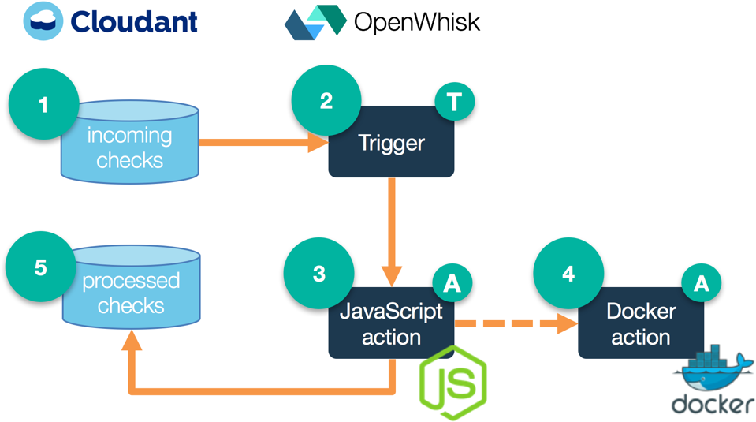

# OpenWhisk 101 - Your first Action, Trigger, and Rule

Simple demo showing OpenWhisk actions, triggers, and rules. Created for the [Build a cloud native app with Apache OpenWhisk webinar](https://developer.ibm.com/tv/build-a-cloud-native-app-with-apache-openwhisk/).

A demo highlighting OpenWhisk polyglot application development. This example shows how to write actions in both JavaScript and Docker, respond to database triggers, and invoke actions in a workflow asynchronously.

When an image is added to a Cloudant database, this event triggers the JavaScript action to download the file and resize it. It also invokes an optical character recognition library packaged as an action in Docker.



1. Image uploaded to Cloudant
2. Trigger fired in OpenWhisk
3. JavaScript action parses image metadata and transforms image
4. Docker action parses image with OCR
5. Extracted info stored back to Cloudant

## JavaScript Action `process-check.js`

This action is invoked by the `new-check-deposit` trigger, which fires when an image of a check is added to a Cloudant database (named `incoming-checks`). The action downloads the image, invokes the `parse-image.sh` action to extract account information, resizes the image, then stores a copy back in another Cloudant database (named `processed-checks`) along with the account data.

## Docker Action `parse-image.sh`

This action is invoked by the `process-check.js` action above. The action downloads the original check image, parses it for account and routing number data, then returns that to the calling action which in turn stores it in the database.

## Running the demo

There is a convenience script for creating and destroying the actions, triggers, and rules. It retrieves configuration information from a `local.env` file that is created from `template.local.env`.

After you've installed the `wsk` binary, created a Cloudant service instance, and installed Docker for your platform, the script can then be used to set up, tear down, and inspect the current configuration:

```bash
./deploy.sh --install
./deploy.sh --uninstall
./deploy.sh --env
```

### Install the `wsk` CLI from Bluemix

After registering for [Bluemix](http://bluemix.net/), navigate to the "[OpenWhisk](https://console.ng.bluemix.net/openwhisk/)" section. You'll find it in the left navigation, under the three horizontal bar (hamburger) icon.

Click the "Download OpenWhisk CLI" button and place the `wsk` binary in your path, such as in `~/bin`. Open a terminal and set your namespace and authorization as shown in step 2\. Then create your first action in step 3 to validate your setup.

### Set up Cloudant database in Bluemix

Under the "Services" option in the left navigation, choose "Data & Analytics", then view the Services portfolio and provision an instance of Cloudant. Save the "Service Credentials" information to `local.env` and launch the dashboard.

In the Cloudant dashboard, create two databases: `incoming-checks` and `processed-checks`.

### Install Docker for Mac (or your platform of choice)

The `deploy.sh` script assumes that you have Docker in your path and that you have a Docker Hub account. Install Docker for your platform and sign up for a Docker Hub account. Enter the credentials in `local.env`.
